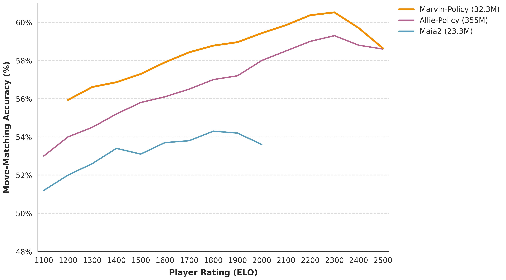
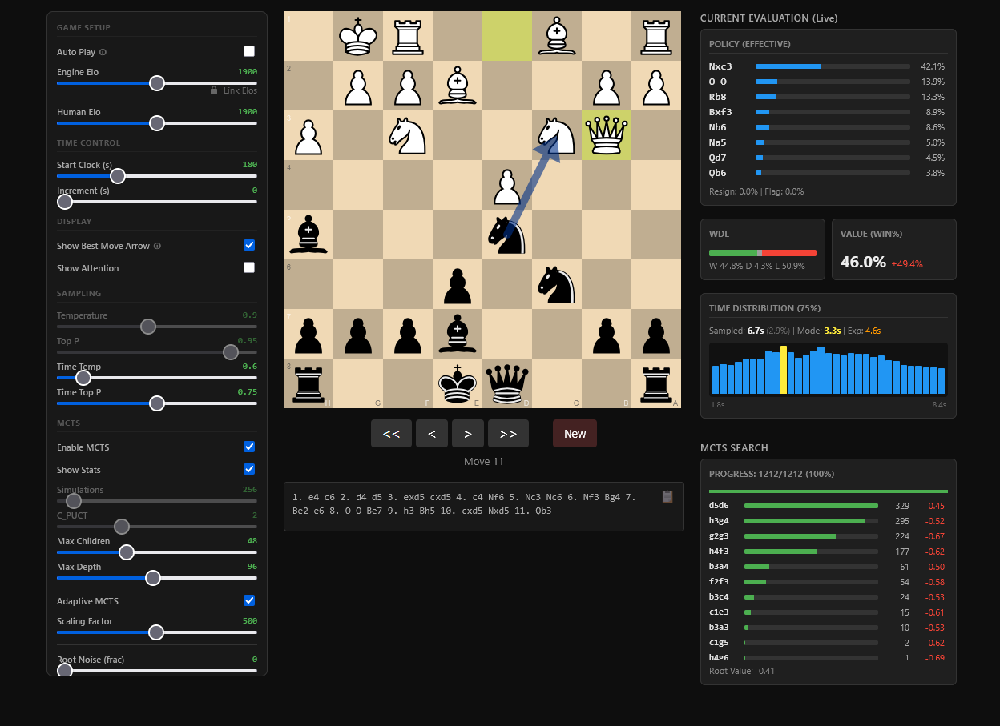

# Marvin Chess

<!-- Badges -->
[](https://www.gnu.org/licenses/agpl-3.0)
[](https://www.python.org/downloads/)
[](https://huggingface.co/holymolyyy/marvin)

Marvin is a **human-like** chess transformer trained on millions of [Lichess](https://lichess.org) games. Unlike traditional engines that seek the absolute best move, Marvin was trained to mimic human play styles across skill levels (1200–2500 Elo).

It is **context-aware**, meaning it adapts its play based on remaining clock time, opponent rating, and time control.

## Architecture

Marvin uses a transformer architecture with token-based conditioning, using techniques from [Leela Chess Zero](https://lczero.org/blog/2024/02/transformer-progress/) and Daniel Monroe's "[Mastering Chess with a Transformer Model](https://arxiv.org/abs/2409.12272)".

Context (Elo, clock, time control) is injected via 6 conditioning tokens prepended to the 64 square tokens. The model produces three primary outputs:
1.  **Policy**: Move probabilities (including resign/flag).
2.  **Time**: A 256-bin classification for predicted thinking time.
3.  **Value**: Win/Draw/Loss probabilities.

### Model Sizes
*   **Small** (`CONFIG_SMALL`): ~**23M parameters**. Compact and fast; the default for inference.
*   **Large** (`CONFIG_LARGE`): ~**108M parameters**. Higher capacity for increased playing strength at a higher compute cost.

## Results

Marvin accurately mimics human play-style in the 1200-2300 ELO range.
Marvin (23M params) has been evaluated against state-of-the-art human-mimicking models.

<p align="center">
  
  <br>
  <em><b>Figure 1:</b> Human move-matching accuracy comparison with <a href="https://arxiv.org/abs/2409.20553">Maia2</a> and <a href="https://arxiv.org/abs/2410.03893">Allie</a>.</em>
</p>


### Web Interface
The project includes a GUI for seeing prediction distributions, live parameter tweaking, experimenting, and playing against the model.

<p align="center">
  
  <br>
  <em><b>Figure 2:</b> The local web interface.</em>
</p>

## Installation

Tested on Windows and Linux/WSL with Python 3.10+.

```bash
git clone https://github.com/zingalorp/marvin-chess-ai.git
cd marvin-chess-ai
python -m venv venv
source venv/bin/activate
pip install -r requirements.txt
```

## Usage

**Web interface:**
```bash
python -m inference.app
```

**UCI engine (PyTorch):**
```bash
python -m inference.uci_engine
```

**UCI engine (ONNX - lightweight, no PyTorch required):**
```bash
python -m inference.uci_onnx
```

## Play on Lichess

You can challenge the Marvin bots directly on Lichess:

*   [Marvin-1200](https://lichess.org/@/marvin-1200)
*   [Marvin-1600](https://lichess.org/@/marvin-1600)
*   [Marvin-2000](https://lichess.org/@/marvin-2000)
*   [Marvin-2400](https://lichess.org/@/marvin-2400)

## Model Weights

Model weights and checkpoints are available on [Hugging Face](https://huggingface.co/holymolyyy/marvin).

## Acknowledgments

- [Lichess](https://lichess.org) for training data and bot infrastructure
- [Leela Chess Zero](https://lczero.org) for architectural techniques
- [lichess-bot](https://github.com/lichess-bot-devs/lichess-bot) for the bot framework (integration is maintained separately)
- [Chessground](https://github.com/lichess-org/chessground) for the web board UI

## License

AGPL-3.0