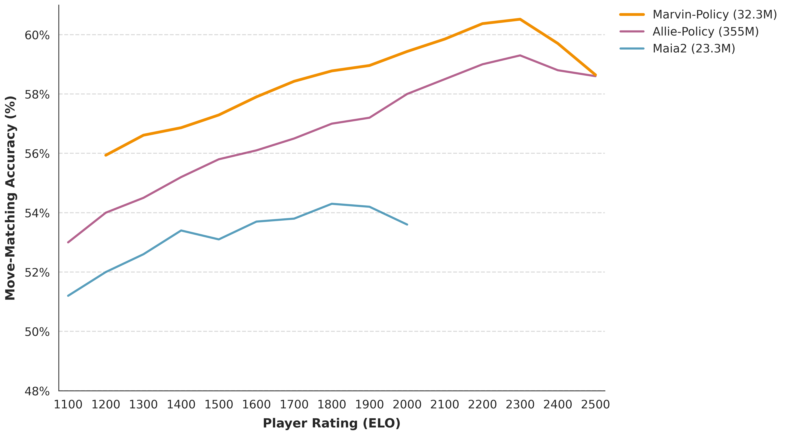

# Marvin Chess

[](https://www.gnu.org/licenses/agpl-3.0)
[](https://www.python.org/downloads/)
[](https://huggingface.co/holymolyyy/marvin)

Marvin is a **human-like** chess transformer trained on millions of [Lichess](https://lichess.org) games. Instead of playing the best move, it mimics human play across skill levels (1200-2400 Elo) and adapts to clock time and time control.

<p align="center">
  
  <br>
  <em>Human move-matching accuracy vs <a href="https://arxiv.org/abs/2409.20553">Maia2</a> and <a href="https://arxiv.org/abs/2410.03893">Allie</a>.</em>
</p>

## Architecture

Transformer with conditioning tokens (Elo, clock, time control) prepended to 64 square tokens. Outputs: policy, value (WDL), and predicted thinking time.

Three sizes:
- **Large** (~49M params) - full quality
- **Small** (~23M params) - good middle-ground
- **Tiny** (~5M params) - fast and lightweight

## Installation

### Linux

```bash
git clone https://github.com/zingalorp/marvin-chess-ai.git
cd marvin-chess-ai
python -m venv venv && source venv/bin/activate
pip install -r requirements.txt
python setup.py          # downloads inference/marvin_small.onnx (~92 MB) from Hugging Face
```

### Windows

```powershell
git clone https://github.com/zingalorp/marvin-chess-ai.git
cd marvin-chess-ai
python -m venv venv
venv\Scripts\activate
pip install -r requirements.txt
python setup.py          # downloads inference/marvin_small.onnx (~92 MB) from Hugging Face
```

## Usage

| Mode | Command | Notes |
|---|---|---|
| Web interface | `python -m inference.app` | Full parameter control via UI |
| UCI engine | `python -m inference.uci_engine` | All conditioning as UCI options |
| lc0 / chess GUI | `lc0 --weights "marvin_1600.pb.gz" --backend=onnx-cuda` | Frozen Elo and Time context, no Python needed |

Both `app.py` and `uci_engine.py` default to `marvin_small.onnx`. Use `--weights <path>` to load a different model (`.onnx`):


## Model Weights

All weights are on [Hugging Face](https://huggingface.co/holymolyyy/marvin).

- **`.onnx`** - ONNX Runtime weights (`marvin_large.onnx`, `marvin_small.onnx`, `marvin_tiny.onnx`). Default format for `app.py` and `uci_engine.py`.
- **`.pt`** - PyTorch training checkpoints (`large_750k.pt`, `small_750k.pt`, `tiny_750k.pt`). Used for training and exporting.
- **`.pb.gz`** - For use with [Leela Chess Zero](https://lczero.org). One file per Elo level (1200-2400), with frozen Elo and time context.

## Using Marvin with lc0

The `.pb.gz` files drop into lc0 like any other weight file, as long as you use an ONNX build of lc0.

**Windows:** Download `lc0-vX.X.X-windows-onnx-dml.zip` from the [lc0 releases](https://github.com/LeelaChessZero/lc0/releases). Drop the `.pb.gz` into the lc0 folder, add lc0 as an engine in your GUI, and point it at the weights file. Set the lc0 backend to `onnx-cuda`, `onnx-dml`, or `onnx-cpu`.

**Linux:** No pre-built ONNX binary is available. Build lc0 from source with ONNX Runtime:
```bash
git clone --recurse-submodules https://github.com/LeelaChessZero/lc0.git && cd lc0
./build.sh -Donnx_include=<ORT_PATH>/include -Donnx_libdir=<ORT_PATH>/lib
```

**Recommended lc0 settings:**

| Option | Value | Notes |
|---|---|---|
| nodes | `1` | Policy-only play; can be increased for stronger play|
| `--backend` | `onnx-dml` or `onnx-cpu` | Required |
| `--PolicyTemperature` | `0.0-1.0` | Lower = less random |
| `--MiniBatchSize` | `1` | When nodes is set to 1

## Play on Lichess

[marvin-1200](https://lichess.org/@/marvin-1200) / [marvin-1600](https://lichess.org/@/marvin-1600) / [marvin-2000](https://lichess.org/@/marvin-2000) / [marvin-2400](https://lichess.org/@/marvin-2400)

## Finetune to 'Clone' a player
I've included a `process_pgn_player.py` script that processes a pgn of a single user into the processed dataset format for finetuning a marvin model. Seems to work well with players with ~10k+ games. Recommended 5-8 training epochs.

## Acknowledgments

- [Lichess](https://lichess.org) for training data and bot infrastructure
- [Leela Chess Zero](https://lczero.org) for architectural inspiration and the MCTS inference framework
- [lichess-bot](https://github.com/lichess-bot-devs/lichess-bot) for the bot framework
- [Chessground](https://github.com/lichess-org/chessground) for the web board UI
- Daniel Monroe & Philp A. Chalmers paper ["Mastering Chess with a Transformer Model"](https://arxiv.org/abs/2409.12272)

## License

AGPL-3.0