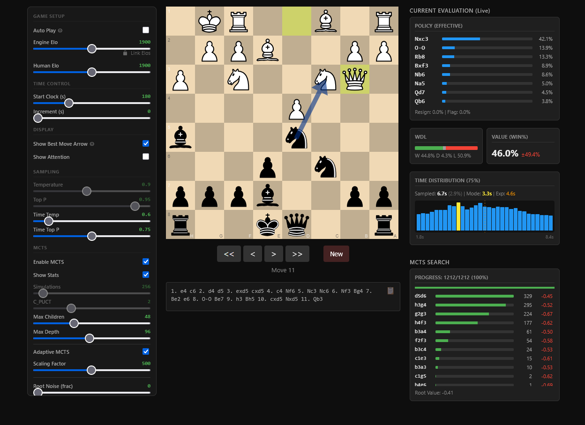

# Marvin Chess

A human-like chess transformer designed to mimic human play across skill levels (1200-2500 Elo). The model is time-aware, adapting its play based on remaining clock time, opponent rating, and time control.

## Overview

Marvin is trained on millions of [Lichess](https://lichess.org) games to predict moves, time usage, and game outcomes. The goal is an engine that plays like a human - natural moves, realistic mistakes, and appropriate time management for the emulated skill level.

There are two model sizes available:
- **small** (`CONFIG_SMALL`) — compact and fast (about **23M parameters**), used by default for inference and training unless a different config is requested.
- **large** (`CONFIG_LARGE`) — higher-capacity model (~**110M parameters**) for better strength at higher compute cost.

The architecture uses techniques from [Leela Chess Zero](https://lczero.org/blog/2024/02/transformer-progress/) and Daniel Monroe's "[Mastering Chess with a Transformer Model](https://arxiv.org/abs/2409.12272)" in a transformer with token-based conditioning. Primary output heads include:

- **Policy**: Move probabilities (4096 from-to squares + resign + flag)
- **Time**: 256-bin classification for thinking time
- **Value**: Win/Draw/Loss probabilities

Context conditioning (Elo, clock, time control) is injected via 6 conditioning tokens prepended to the 64 square tokens.

## Results
Human move-matching accuracy comparison with [Maia2](https://arxiv.org/abs/2409.20553) and [Allie](https://arxiv.org/abs/2410.03893)


## Contents

- `model.py`, `train.py`, `dataset.py`, `process_pgn.py` - Training pipeline
- `inference/app.py` - Web interface for play/analysis
- `inference/uci_engine.py` - UCI protocol for chess GUIs
- `inference/mcts.py` - MCTS with WDL evaluation
- `lichess-bot/` - Modified [lichess-bot](https://github.com/lichess-bot-devs/lichess-bot) for online play

### `inference/app.py` 
GUI for prediction distributions, live parameter tweaking, experimenting, and playing against the model.



## Installation

Tested on Linux/WSL with Python 3.10+.

```bash
git clone https://github.com/zingalorp/marvin-chess.git
cd marvin-chess
python -m venv venv
source venv/bin/activate
pip install -r requirements.txt
```

## Usage

**Web interface:**
```bash
python -m inference.app
```

**UCI engine:**
```bash
python -m inference.uci_engine
```

**Lichess bot:** See `lichess-bot/config.example.yml` for setup.

**Selecting model size for inference:** Set the environment variable `MARVIN_CONFIG` to `small` or `large`, or leave it as `auto` (the code will try to detect the correct config from the checkpoint).

## Play on Lichess

You can also play against the Marvin bots on Lichess:

- [Marvin-1200](https://lichess.org/@/marvin-1200)
- [Marvin-1600](https://lichess.org/@/marvin-1600)
- [Marvin-2000](https://lichess.org/@/marvin-2000)
- [Marvin-2400](https://lichess.org/@/marvin-2400)
- [Marvin-GM](https://lichess.org/@/marvin-GM)

## Model Weights

Pretrained model weights are available on [Hugging Face](https://huggingface.co/holymolyyy/marvin).

## Acknowledgments

- [Lichess](https://lichess.org) for training data and bot infrastructure
- [Leela Chess Zero](https://lczero.org) for architectural techniques
- [lichess-bot](https://github.com/lichess-bot-devs/lichess-bot) for the bot framework
- [Chessground](https://github.com/lichess-org/chessground) for the web board UI

## License

AGPL-3.0